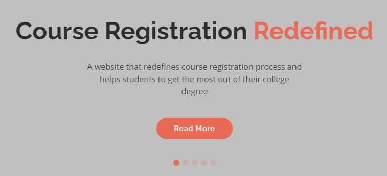

<!-- PROJECT LOGO -->
 

    
  </a>

  <h3 align="center">Improvised Course Registration</h3>

  

    An idea to make College Course Management Procedures more flexible, transparent and easy to use
     
    <a href="http://improvised-course-registration.herokuapp.com/">Link</a>
  

<!-- ABOUT THE PROJECT -->
## About The Project

    
  </a>
   

Improvised Course Registration is majorly a project that can help students in colleges to make the most out of their college degree
      
Here's why:
      
* Check for all the prerequisites of a course before registering for it  
* Industry-relevant tracks having courses offered by the college that students can follow according to their interests  
* Completely transparent Course details so that students have all information related to all the courses beforehand like Labs, Assignments, tests ,teachers etc   
* Removes Branch Barriers ,  by helping recruiters shortlist the students on the basis of courses that they have done instead of their branch branch  

